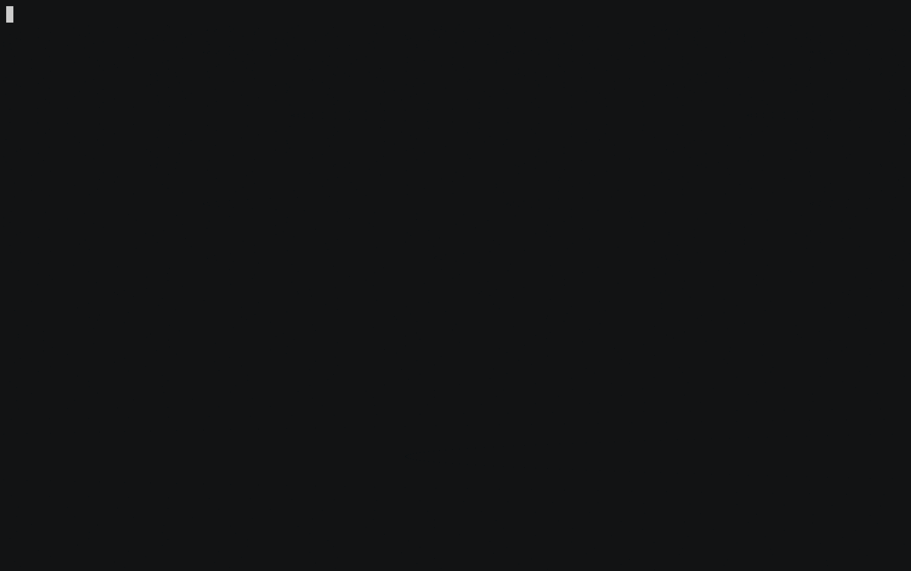

# Console

A C++ collection of library for console application.

## Contents
- [Console](#console)
  - [Contents](#contents)
  - [How to use](#how-to-use)
  - [Usages](#usages)
    - [ANSI / VT100 Terminal Control Escape Sequences](#ansi--vt100-terminal-control-escape-sequences)
      - [Demo](#demo)
      - [Overview](#overview)
      - [Text Attribute](#text-attribute)
      - [Color](#color)
        - [Named color](#named-color)
        - [Rgb](#rgb)
      - [Etc](#etc)
        - [Cursor control](#cursor-control)
        - [Scrolling](#scrolling)
        - [Tab Control](#tab-control)
        - [Erasing Text](#erasing-text)
    - [Animation](#animation)
      - [Example](#example)
      - [Predefined Animations](#predefined-animations)
      - [Custom Animation](#custom-animation)
    - [Flag](#flag)
      - [Demo](#demo-1)
      - [Overview](#overview-1)
      - [Predefined Flags](#predefined-flags)
      - [Vector Flag](#vector-flag)
      - [Custom Flag](#custom-flag)
      - [SubParser](#subparser)

## How to use

To use `console`, add the followings to your `WORKSPACE` file.

```python
load("@bazel_tools//tools/build_defs/repo:http.bzl", "http_archive")

http_archive(
    name = "com_chokobole_console",
    sha256 = "<sha256>",
    strip_prefix = "console-<commit>",
    urls = [
        "https://github.com/chokobole/console/archive/<commit>.tar.gz",
    ],
)

load("@com_chokobole_console//bazel:console_deps.bzl", "console_deps")

console_deps()

load("@com_chokobole_color//bazel:color_deps.bzl", "color_deps")

color_deps()

load("@com_chokobole_base//bazel:base_deps.bzl", "base_deps")

base_deps()

load("@com_chokobole_bazel_utils//:buildifier_deps.bzl", "buildifier_deps")

buildifier_deps()

load("@com_chokobole_bazel_utils//:buildifier_deps_deps.bzl", "buildifier_deps_deps")

buildifier_deps_deps()
```

Then, in your `BUILD` files, import and use the rules.

```python
cc_binary(
    name = "name",
    srcs = [...],
    deps = ["@com_chokobole_console//:console"],
)
```

## Usages

### ANSI / VT100 Terminal Control Escape Sequences

#### Demo


#### Overview

Before going deeper, let's see the simple example below.

```c++
#include <iostream>
#include "console/stream.h"

console::Stream stream;
stream.Red();
std::cout << "red" << std::endl;
```

The example above prints out the `"red"` as `red` colored text. Ah simple! But for those who use [ANSI escaped code](https://en.wikipedia.org/wiki/ANSI_escape_code) for the first time, the second example might be troublesome.

```c++
console::Stream stream;
stream.Red();
std::cout << "red" << std::endl;
std::cout << "plain" << std::endl;
```

What color do you think the `"plain"` will be printed out? The answer is `red`. Why? Because you didn't reset the color, so the color code applied to `"red"` still was on. So you have to explicitly set the color code off like below.

```c++
console::Stream stream;
stream.Red();
std::cout << "red" << std::endl;
stream.ColorOff();
std::cout << "plain" << std::endl;
```

For convenience, at destruction of `console::Stream` invalidate all the attributes. So it maybe helps you from calling ~Off methods everytime. **NOTE: But for the background, maybe you have to call `EraseEndOfLine` to clear the background.**

```c++
{
  console::Stream stream;
  stream.Red();
  std::cout << "red" << std::endl;
}
```

Also you can give any kind of `std::ostream` to `console::Stream`, so that you can make a helper function like below.

```c++
std::string Info(const std::string& text) {
  std::stringstream ss;
  {
    console::Stream stream(ss);
    stream.Green().Bold();
    ss << "INFO: ";
  }
  ss << text;
  return ss.str();
}
```

**NOTE: If you are working on windows, you have to enable ANSI like below.**

```c++
#if defined(OS_WIN)
  console::Console::EnableAnsi(std::cout);
#endif
```

#### Text Attribute

* `Reset()`: All attributes off
* `Bold()`: To off, call `BoldOff()`
* `Dim()`: To off, call `DimdOff()`
* `Italic()`: To off, call `ItalicOff()`
* `Underline()`: To off, call `UnderlineOff()`
* `BlinkSlow()`: To off, call `BlinkOff()`
* `BlinkRapid()`: To off, call `BlinkOff()`
* `Inverse()`: To off, call `InverseOff()`
* `Conceal()`: To off, call `ConcealOff()`
* `StrikeThrough()`: To off, call `StrikeThroughOff()`

#### Color

To off color, call `ColorOff()`, to off background color, call `BgColorOff()`.

##### Named color

* `Black()`
* `Red()`
* `Green()`
* `Yellow()`
* `Blue()`
* `Magenta()`
* `Cyan()`
* `White()`
* `LightBlack()`
* `LightRed()`
* `LightGreen()`
* `LightYellow()`
* `LightBlue()`
* `LightMagenta()`
* `LightCyan()`
* `LightWhite()`
* `BgBlack()`
* `BgRed()`
* `BgGreen()`
* `BgYellow()`
* `BgBlue()`
* `BgMagenta()`
* `BgCyan()`
* `BgWhite()`
* `BgLightBlack()`
* `BgLightRed()`
* `BgLightGreen()`
* `BgLightYellow()`
* `BgLightBlue()`
* `BgLightMagenta()`
* `BgLightCyan()`
* `BgLightWhite()`

##### Rgb

If you want to use custom color, you can call `Rgb(color::Rgb)` method. It automatically detects whether the terminal supports [8-bit](https://en.wikipedia.org/wiki/ANSI_escape_code#8-bit) or [24-bit](https://en.wikipedia.org/wiki/ANSI_escape_code#24-bit). You can read the [README.md](https://github.com/chokobole/color/blob/master/README.md) from [color](https://github.com/chokobole/color).

#### Etc

**NOTE: Explanation was taken and modified from http://www.termsys.demon.co.uk/vtansi.htm**

##### Cursor control

* `SetCursor(size_t row = 0, size_t column = 0)`: Sets the cursor position where subsequent text will begin. If no row/column parameters are provided, the cursor will move to the home position, at the upper left of the screen.
* `CursorUp(size_t n = 1)`: Moves the cursor up by `n` rows.
* `CursorDown(size_t n = 1)`: Moves the cursor down by `n` rows.
* `CursorForward(size_t n = 1)`: Moves the cursor forward by `n` columns.
* `CursorBackward(size_t n = 1)`: Moves the cursor backward by `n` columns.
* `SaveCursor()`: Saves current cursor position.
* `RestoreCursor()`: Restores cursor position after the save point.
* `SaveCursorAndAttributes()`: Save current cursor position and attributes.
* `RestoreCursorAndAttributes()`: Restores cursor position after the save point and attributes.

##### Scrolling

* `ScrollScreen()`: Enable scrolling for entire display.
* `ScrollScreen(size_t start, size_t end)`: Enable scrolling from row `start` to row `end`.
* `ScrollDown()`: Scroll display down one line.
* `ScrollUp()`: Scroll display up one line.

##### Tab Control

* `SetTab()`: Sets a tab at the current position.
* `ClearTab()`: Clears tab at the current position.
* `ClearAllTab()`: Clears all tabs.

##### Erasing Text

* `EraseEndOfLine()`: Erases from the current cursor position to the end of the current line.
* `EraseStartOfLine()`: Erases from the current cursor position to the start of the current line.
* `EraseEntireLine()`: Erases the entire currnet line.
* `EraseDown()`: Erases the screen from the current line down to the bottom of the screen.
* `EraseUp()`: Erases the screen from the current line up to the top of the screen.
* `EraseScreen()`: Erases the screen with the background colour and moves the cursor to home.

### Animation

#### Example

Let's see a simple example like below.

```c++
#include <chrono>
#include <thread>

#include "color/colormap.h"
#include "console/animation.h"
#include "console/stream.h"

int main() {
  console::Stream stream;
  color::Colormap colormap;
  std::vector<color::Rgb> rainbow_colors;
  colormap.Rainbow(30, &rainbow_colors);

  const char* text =
      "Lorem ipsum dolor sit amet, consectetur adipiscing elit\n";

  std::unique_ptr<console::FlowTextAnimation> flow_animation(
      new console::FlowTextAnimation());
  flow_animation->set_repeat(true);
  flow_animation->set_colors(rainbow_colors);
  flow_animation->set_text(text);
  console::AnimationGroup group;
  group.AddAnimation(std::move(flow_animation));
  group.set_on_animation_did_update([](size_t) {
    console::Stream stream;
    stream.CursorUp(1);
    stream.EraseEndOfLine();
  });

  while (true) {
    group.Update();
    std::this_thread::sleep_for(std::chrono::milliseconds(100));
  }

  return 0;
}
```

#### Predefined Animations

* `FlowTextAnimation`
* `RadarTextAnimation`
* `NeonTextAnimation`
* `KaraokeTextAnimation`

 You can find how to use those animations in [examples/animation.cc](examples/animation.cc)

#### Custom Animation

Also you can define custom animation like below! You can find the full code in [examples/custom_animation.cc](examples/custom_animation.cc)

```c++
class ProgressAnimation : public console::Animation {
 public:
  explicit ProgressAnimation(size_t total_frames)
      : total_frames_(total_frames) {}

 private:
  bool ShouldUpdate() override { return current_frame_ < total_frames_; }

  void DoUpdate() override {
    int did = static_cast<double>(current_frame_ + 1) / total_frames_ * 50;
    for (int i = 0; i < did; ++i) {
      std::cout << "=";
    }
    std::cout << ">";
    for (int i = 0; i < 50 - did; ++i) {
      std::cout << " ";
    }
    std::cout << "[" << (current_frame_ + 1) << " / " << total_frames_ << "]\n";
  }

  size_t total_frames_;
};

int main() {
  bool updating = true;
  ProgressAnimation animation(100);
  animation.set_on_animation_end([&updating] { updating = false; });
  animation.set_on_animation_did_update([](size_t) {
    console::Stream stream;
    stream.CursorUp(1);
    stream.EraseEntireLine();
  });

  do {
    animation.Update();
    std::this_thread::sleep_for(std::chrono::milliseconds(100));
  } while (updating);

  return 0;
}
```

### Flag

#### Demo



#### Overview

* Easy
* Explaniable
* Customizable
* Composable

Let's see a simple example like below. You can find the full code in [examples/simple_flag.cc](examples/simple_flag.cc)

```c++
#include "console/flag.h"

int main(int argc, char** argv) {
  struct Person {
    std::string name;
    uint8_t age;
    bool married;
  };

  Person person;
  console::FlagParser flag_parser;
  flag_parser.set_program_name("simple_flag");
  flag_parser.AddFlag<console::StringFlag>(&person.name)
      .set_name("name")
      .set_help("what's your name?");
  flag_parser.AddFlag<console::Uint8Flag>(&person.age)
      .set_name("age")
      .set_help("how old are you?");
  flag_parser.AddFlag<console::BoolFlag>(&person.married)
      .set_long_name("--married")
      .set_help("are you married?");
  flag_parser.Parse(argc, argv);
}
```

```bash
# bazel build //examples:simple_flag

$ bazel-bin/examples/simple_flag foo 25 --married
{
  name: foo
  age: 25
  married: true
}
```

There are some rules to compose flags.
1. Flag must have `short_name`, `long_name` or `name`. All the names should contain alphabet or digit. But `short_name` has a prefix "-" and `long_name` has a prefix "--". `long_name` and `short_name` can be set together, but `name` shouldn't.
2. Positional arguments should be before optional arguments.
3. BoolFlag should be optional.
4. SubParser should be positional.
5. SubParser and positional arguments can't be together.

#### Predefined Flags

* `BoolFlag`: Equals to `Flag<bool>`
* `Uint8Flag`: Equals to `Flag<uint8_t>`
* `Int8Flag`: Equals to `Flag<int8_t>`
* `Uint16Flag`: Equals to `Flag<uint16_t>`
* `Int16Flag`: Equals to `Flag<int16_t>`
* `Uint32Flag`: Equals to `Flag<uint32_t>`
* `Int32Flag`: Equals to `Flag<int32_t>`
* `Uint64Flag`: Equals to `Flag<uint64_t>`
* `Int64Flag`: Equals to `Flag<int64_t>`
* `FloatFlag`: Equals to `Flag<float>`
* `DoubleFlag`: Equals to `Flag<double>`
* `StringFlag`: Equals to `Flag<std::string>`

#### Vector Flag

In case you want to receive numbers of arguments, you can add `console::Flag<std::vector<T>>` like below. You can find the full code in [examples/vector_flag.cc](examples/vector_flag.cc).

```c++
std::vector<int> numbers;
console::FlagParser flag_parser;
flag_parser.set_program_name("vector_flag");
flag_parser.AddFlag<console::Flag<std::vector<int>>>(&numbers)
    .set_short_name("-n")
    .set_long_name("--number")
    .set_help("numbers for add, you can accumulate!")
    .set_required();
```

Then you can use the program like below.

```bash
# bazel build //examples:vector_flag

$ bazel-bin/examples/vector_flag -n 1 -n 2 -n 3
[SUM]: 6
```

#### Custom Flag

If you want to handle flags besides provided ones, then you have 2 options. First, you can do with function callback. You can find the full code in [examples/custom_flag.cc](examples/custom_flag.cc). **NOTE: Because it is desgined to be used without exception and with string_view, it depends on [abseil-cpp](https://github.com/abseil/abseil-cpp) internally.**

```c++
uint16_t number;
console::FlagParser flag_parser;
flag_parser.set_program_name("custom_flag");
flag_parser
    .AddFlag<console::Uint16Flag>(
        [&number](absl::string_view input, std::string* reason) {
          uint32_t n;
          if (absl::SimpleAtoi(input, &n)) {
            if (n > std::numeric_limits<uint16_t>::max()) {
              *reason = absl::StrFormat("%u is out of its range", n);
              return false;
            }
            if (n % 2 == 0) {
              *reason = absl::StrFormat("%u is not a odd number", n);
              return false;
            } else {
              number = n;
              return true;
            }
          }

          *reason =
              absl::StrFormat("failed to convert to number (\"%s\")", input);
          return false;
        })
    .set_name("number")
    .set_required()
    .set_help("Please input only odd numbers!");
```

```bash
# bazel build //examples:custom_flag

$ bazel-bin/examples/custom_flag 2
[ERROR]: number is failed to parse: (reason: 2 is not a odd number).
$ bazel-bin/examples/custom_flag 65536
[ERROR]: number is failed to parse: (reason: 65536 is out of its range).
$ bazel-bin/examples/custom_flag -1
[ERROR]: number is failed to parse: (reason: failed to convert to number ("-1")).
```

The other one is using specialized templated class. You can find the full code in [examples/custom_flag2.cc](examples/custom_flag2.cc).

```c++
struct OddNumber {
  uint16_t number;
};

namespace console {

template <>
class FlagValueTraits<OddNumber> {
 public:
  static bool ParseValue(absl::string_view input, OddNumber* value,
                         std::string* reason) {
    // same above
  }
};

}  // namespace console

OddNumber number;
console::FlagParser flag_parser;
flag_parser.set_program_name("custom_flag2");
flag_parser.AddFlag<console::Flag<OddNumber>>(&number)
    .set_name("number")
    .set_required()
    .set_help("Please input only odd numbers!");
```

#### SubParser

Sometimes you maybe want to use subcommand like `git commit` or `git log`. When `commit` or `log` comes, the flags get differnt! You can do this with `SubParser`. You can find the full code in [examples/sub_parser.cc](examples/sub_parser.cc).

```c++
struct Add {
  int a;
  int b;
};

struct Pow {
  int base;
  int exponent;
};

Add add;
Pow pow;
console::FlagParser flag_parser;
flag_parser.set_program_name("sub_parser");
console::SubParser& add_parser = flag_parser.AddSubParser();
add_parser.set_name("add").set_help("add");
add_parser.AddFlag<console::Int32Flag>(&add.a).set_name("a").set_help(
    "number1 for add");
add_parser.AddFlag<console::Int32Flag>(&add.b).set_name("b").set_help(
    "number2 for add");
console::SubParser& pow_parser = flag_parser.AddSubParser();
pow_parser.set_name("pow").set_help("pow");
pow_parser.AddFlag<console::Int32Flag>(&pow.base).set_name("base").set_help(
    "base for pow");
pow_parser.AddFlag<console::Int32Flag>(&pow.exponent)
    .set_name("exponent")
    .set_help("exponent for pow");
```

```bash
# bazel build //examples:sub_parser

$ bazel-bin/examples/sub_parser -h
Usage:

sub_parser <command> [--verbose]

Commands:

add                 add
pow                 pow

$bazel-bin/examples/sub_parser add -h
Usage:

sub_parser add a b

Positional arguments:

a                   number1 for add
b                   number2 for ad

$ bazel-bin/examples/sub_parser add 1 2
[ADD]: 3
$ bazel-bin/examples/sub_parser pow 1 2
[POW]: 1
```


